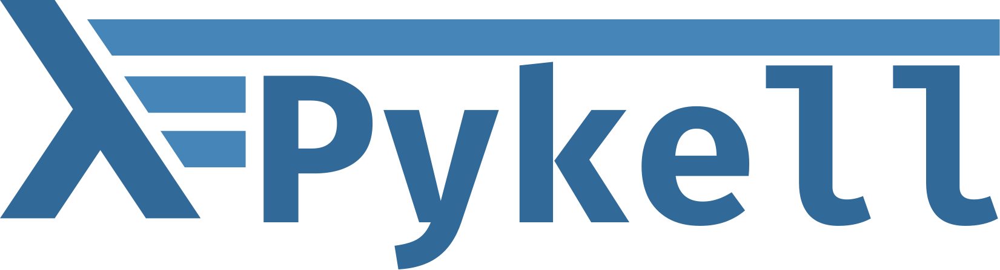

# Pykell

Python functional programming library inspired by Haskell.

This is a personal project to deepen my understanding of functional programming by implementing this DSL in python. 

It is open-source, so feel free to open issues and pull requests!


```haskell 
f = filter (\x -> x / 3 < 10)

g = (\x -> x - 2) . (\x -> x ^ 3)

x = fmap g Just 5                   -- Just 27

```

```python
f = filter |(lambda x: x / 3 < 10)  

g = F(lambda x: x - 2) >> F(lambda x: x ** 3)

x = fmap |g |Just(5)                # Just 27
```

## Installing

We currently have a stable release under pypi:

```bash
pip install pykell
```

## Features
This DSL makes it easy to write functional programming patters with a clean syntax.

### Functions
This is an abstraction layer on top of Python regular functions and lambdas.

```python
from pykell.functions import F


# Via a decorator 
@F
def f(x: int, y: float) -> float: return x + y


# via a lambda (with type hints support)
g = F[float, str](lambda x: f"This is a float: {x}")


f               # type: Function[int, Function[float, float]]
f2 = f |2       # application via | operator
f2_ = f(2)      # works just as fine!
my_float = f2 |1.5


# Composition
h = f2 >> g     # this will return f2 ∘ g
h | 1.2         # This is a float: 3.2


# Chaining calls 
x = f |2 |1.5

```

You have access to many of Haskells Prelude functions:
```python
from pykell.functions import map, filter, foldr, head, tail, all, any

map    |(lambda x: x * 2) |[1, 2, 3]    # [2, 4, 6]

filter |(lambda x: x < 2) |[0, 1, 3]    # [0, 1]


head |[1, 2, 3, 4]                      # 1
tail |[1, 2, 3, 4]                      # [2, 3, 4]


even = F[int, bool](lambda x: x%2==0)
all |even |[2, 3, 4]                    # False
any |even |[2, 3, 4]                    # True


# and many more ...
```


### Containers
These are well known containers that can make your life easyer when programming.
```python
from pykell.typing import Maybe, Just, Nothing 


def f(x: int) -> Maybe[int]:
    return Just(x + 10) if x < 10 else Nothing()

```

### Functors
This is some syntatic sugar to use functors in python.

```python
from pykell.functions import F
from pykell.functors import fmap
from pykell.typing import Maybe, Just


f = F[int, int](lambda x: 2 * x + 3)


fmap |f |Just(5)    # Just 13


fmap |f |[1, 2, 3]  # [5, 7, 9]
```

You can define your own as well, just like in haskell
```python
from pykell.functors import Functor

@Functor(MyType)
def fmap(f, x):
    ... 
```

```haskell
instance Functor MyType where
    fmap f x = ...
```


### Monads
This is a good one.
```python
from pykell.monads import MaybeMonad
from pykell.functions import F
from pykell.typing import Maybe, Just, Nothing


# define some functions we want to compose ...
f = F[int, Maybe[int]]  (lambda x: Just(x + 10) if x < 10 else Nothing())
g = F[int, Maybe[float]](lambda x: Just(x / 7 ) if x < 10 else Nothing())


# Play inside the monadic 'do'!
@MaybeMonad.do
def calculate(x):
    y: int = yield f(x) # yield calls with the bind. 
                        # Think of it like the let! in f# or x <- ... in Haskell. 

    if y < 5:           # besides the yield everything works as normal!
        return y + 5

    z: float = yield g(z)
    return z - 1.5


calculate(-10)          # Just(5)
calculate(4)            # Just(2.0)
calculate(11)           # Nothing()
```


### Arrays
This is inspired by other array language features but use haskells lazyness to do computations.
The syntax is more Scala-like, But it is still a nice feature

```python
from pykell.arrays import arr

result = (
    arr([1, 2, 3])
    .map(lambda x: x + 1)
    .filter(lambda x: x % 2 != 0)
    .fold(0, lambda acc, cur: cur + acc)
)

print(result._)     # evaluates the expression:


# you can do infinite calculations with it!
def naturals(i=0): 
    while True: yield (i := i + 1)


result = (
    arr(naturals())
    .map(lambda x: x + 1)
    .filter(lambda x: x % 2 != 0)
    .take(10)
)

print(result._)     # 3, 5, 7, ...
```

## Contributions
This is just an experiment. If you have any ideas of features you want to see in here please reach out!
